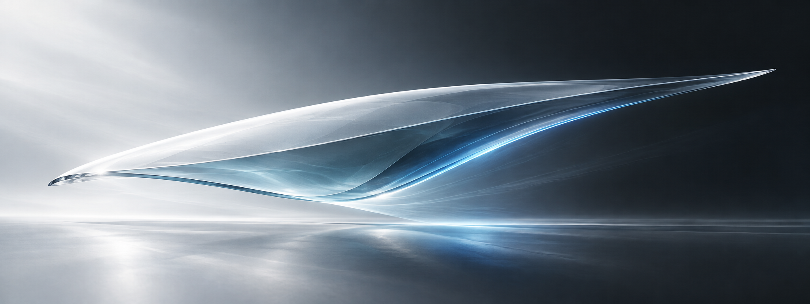
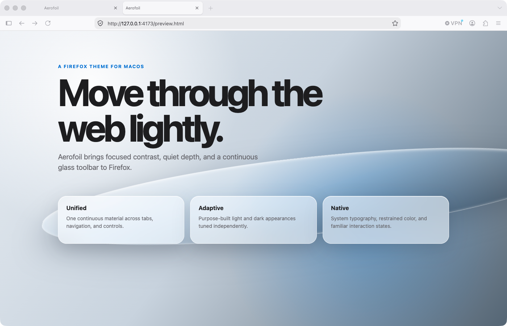
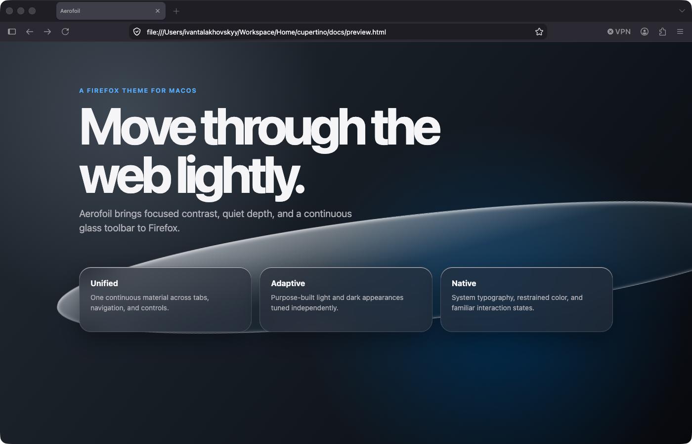

<p align="center">
  
</p>

<p align="center">
  
</p>

<h1 align="center">Aerofoil</h1>

<p align="center">
  A lighter, sharper Firefox theme shaped by glass, motion, and macOS 27.
</p>

<p align="center">
  <a href="https://github.com/vantalter/aerofoil/releases"><strong>Download the latest release</strong></a>
  ·
  <a href="#install-for-development">Install for development</a>
</p>

## Calm chrome. Clear content.

Aerofoil gives Firefox a distinctly native Mac atmosphere without changing how the browser works. Its unified toolbar uses soft reflection, restrained depth, and higher-contrast glass surfaces to keep the interface quiet around the page you are viewing.

It is built entirely with Firefox's supported theme API. There are no scripts, behavioral changes, or `userChrome.css` files to maintain.

## Two atmospheres

| Light | Dark |
| :---: | :---: |
|  |  |
| Frosted silver with a softly lifted address field | Graphite glass with controlled highlights and strong legibility |

## Designed as one material system

- **Unified toolbar** — tabs and navigation sit within one continuous visual surface.
- **Layered glass** — purpose-built SVG artwork adds edge light, depth, and a subtle reflective lift.
- **Balanced contrast** — active, inactive, hover, focus, and selection states remain easy to distinguish.
- **Complete dark mode** — dedicated artwork and colors replace the flat recoloring used by many themes.
- **Native accent** — focused fields, selections, loading states, and attention icons share one restrained blue.
- **Neutral new tab** — light and dark pages stay aligned with the browser chrome instead of introducing a separate tint.

## Install for development

1. Open `about:debugging` in Firefox.
2. Select **This Firefox**.
3. Choose **Load Temporary Add-on**.
4. Select [`manifest.json`](manifest.json) from this repository.

Temporary themes are removed when Firefox restarts. Packaged builds are available from [GitHub Releases](https://github.com/vantalter/aerofoil/releases).

## Build and validate

Aerofoil keeps its toolbar artwork reproducible. The source generator creates the light and dark preview files in `src/` and the six sliced assets consumed by Firefox.

```sh
node scripts/generate-frames.mjs
node scripts/validate.mjs
bash scripts/package.sh
```

The packaged theme is written to `dist/aerofoil-<version>.zip`. Documentation, screenshots, design sources, and development scripts are excluded from the archive. Every push is validated by GitHub Actions, and a tag matching the manifest version (for example, `v1.0.0`) publishes the package to GitHub Releases.

## Project notes

Aerofoil is inspired by the refined Liquid Glass direction of macOS 27 Golden Gate, but it is an independent Firefox theme and does not include Apple software or assets.

The project originated from Corbin Davenport's open-source Firefox theme work. Aerofoil introduces its own identity, material artwork, dark-mode treatment, palette, and documentation.

Mozilla, Firefox, Apple, macOS, and their respective marks belong to their owners. Aerofoil is not affiliated with or endorsed by Mozilla or Apple.

## License

[GNU General Public License v3.0](LICENSE)
